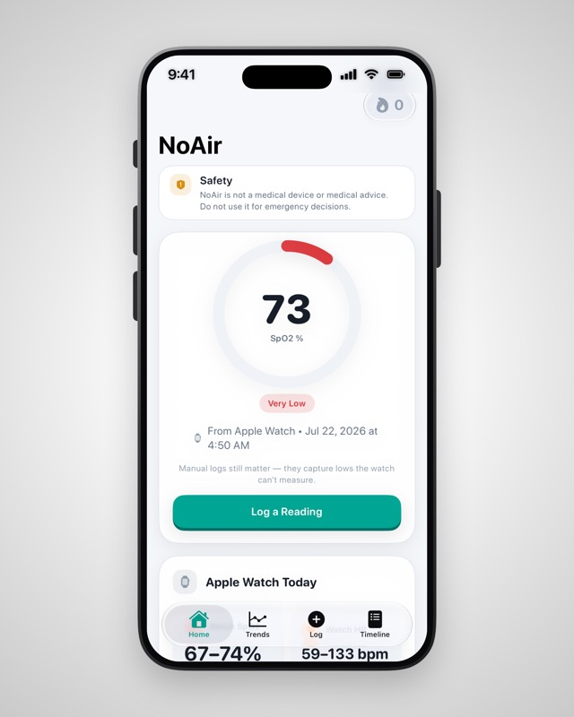
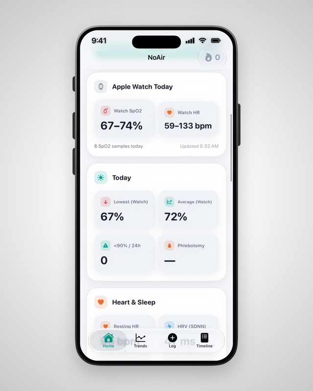
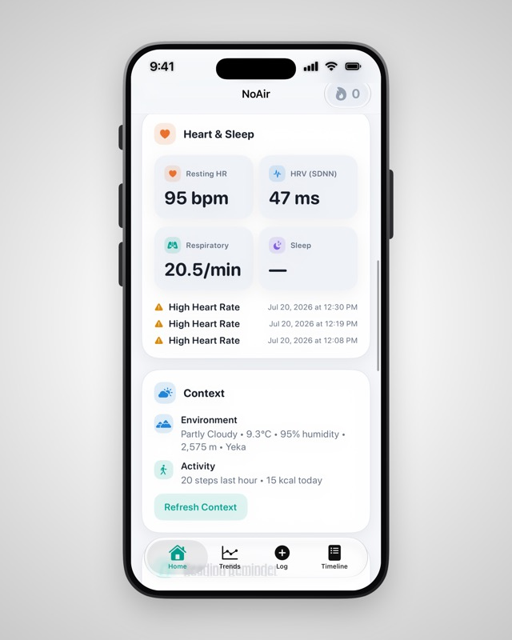
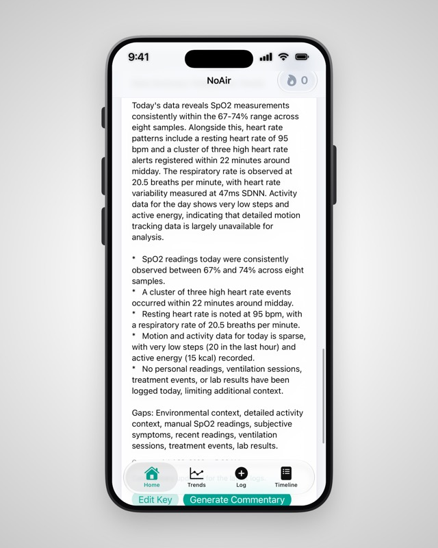
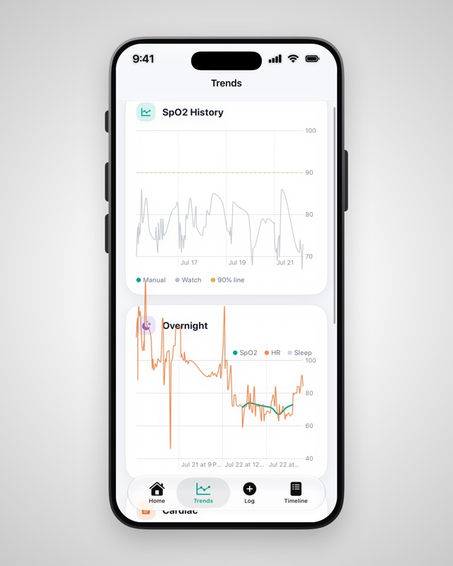
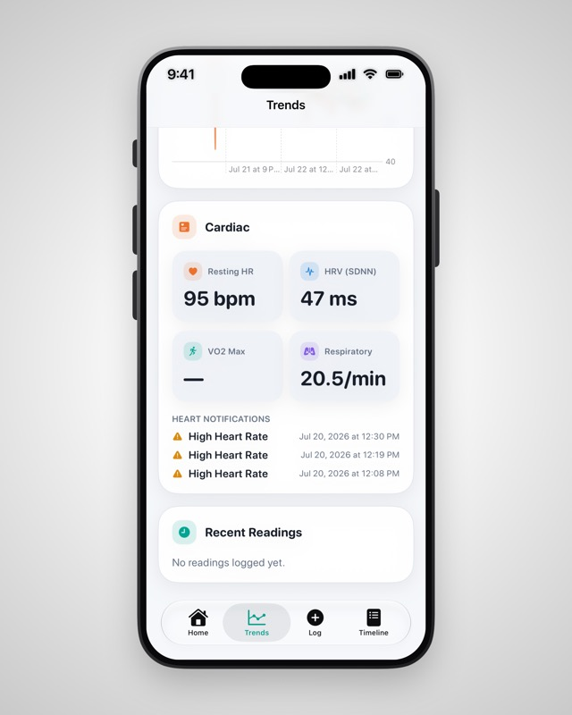
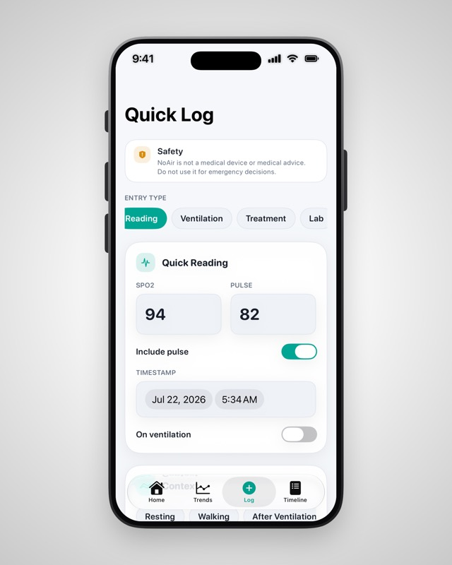
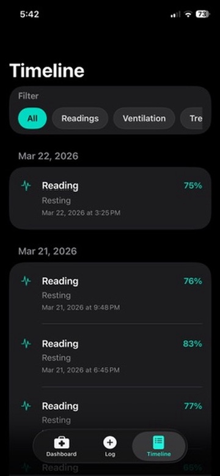

# NoAir

NoAir is a local-first SwiftUI app for logging oxygen saturation (`SpO2`), pulse, symptoms, ventilation sessions, treatments, and lab results on iPhone and iPad.

It is designed to make personal respiratory tracking fast, structured, and useful for pattern awareness. NoAir is not a medical device and does not diagnose conditions, prescribe treatment, or make emergency decisions.

## Screenshots

<table>
  <tr>
    <td align="center" width="25%">
      <br />
      <sub>Home — latest SpO2 reading with a one-tap logging shortcut</sub>
    </td>
    <td align="center" width="25%">
      <br />
      <sub>Home — Apple Watch SpO2/HR ranges and today's lows and averages</sub>
    </td>
    <td align="center" width="25%">
      <br />
      <sub>Home — heart/sleep vitals plus location, weather, and activity context</sub>
    </td>
    <td align="center" width="25%">
      <br />
      <sub>Home — optional AI commentary summarizing recent readings</sub>
    </td>
  </tr>
  <tr>
    <td align="center" width="25%">
      <br />
      <sub>Trends — SpO2 history and overnight SpO2/heart rate</sub>
    </td>
    <td align="center" width="25%">
      <br />
      <sub>Trends — cardiac panel with resting HR, HRV, and heart-rate notifications</sub>
    </td>
    <td align="center" width="25%">
      <br />
      <sub>Quick Log — fast entry for a manual SpO2/pulse reading</sub>
    </td>
    <td align="center" width="25%">
      <br />
      <sub>Timeline — reverse-chronological history of Apple Watch day summaries</sub>
    </td>
  </tr>
</table>

## What The App Does

The current app ships with four primary surfaces:

- `Home`: SpO2 ring gauge for the latest reading, logging streak, daily stats, cardiac/sleep vitals from Apple Health, context summaries, reminders, and AI commentary
- `Trends`: SpO2 history (manual readings over the watch's passive samples), overnight SpO2 + heart rate with sleep stages, and a cardiac panel (resting HR, HRV, VO2 max, respiratory rate, heart-rhythm notifications)
- `Quick Log`: fast entry flows for readings, ventilation sessions, treatments, and lab results
- `Timeline`: reverse-chronological history with filters, editing, and deletion, plus per-day Apple Watch summaries

Persisted records currently include:

- `ReadingRecord`
- `VentilationSession`
- `TreatmentEvent`
- `LabResultRecord`

## Product Characteristics

- Local-first data storage with SwiftData
- Manual-first logging with optional context enrichment
- One unified timeline instead of scattered notes
- Optional AI commentary for descriptive summaries of recent logs
- Clear non-clinical framing throughout the UI

## Context Enrichment

Saved readings can be enriched with passive context when permissions and network access are available:

- location for locality and altitude
- Apple Health for steps, active energy, and recent workouts
- weather from Open-Meteo for temperature, humidity, and conditions

NoAir also supports recurring local notification reminders for logging the next reading.

## Apple Health Integration

NoAir syncs two ways with Apple Health:

- **Import**: watch SpO2 and heart rate (merged into insights, charts, and timeline day summaries), resting heart rate, HRV (SDNN), VO2 max, respiratory rate, sleep stages, irregular/high/low heart-rate notifications, and activity data. HealthKit stays the source of truth — passive samples are never copied into the app's database.
- **Export**: manually logged SpO2 and pulse readings are written to Health with sync identifiers, so edits and deletions in NoAir update or remove the corresponding Health samples. Manual entries matter here: they capture saturation values below the watch's measurable range.

## AI Commentary

The app includes an optional Gemini-based commentary feature:

- API key entry happens in-app
- the key is stored locally on-device
- commentary is intended to be descriptive, not prescriptive

Current implementation uses Google Gemini `gemini-2.5-flash`.

## Project Structure

```text
NoAir/
├── NoAir/
│   ├── Features/
│   │   ├── Dashboard/
│   │   ├── Logging/
│   │   ├── Timeline/
│   │   └── Trends/
│   ├── Models/
│   ├── Services/
│   ├── Shared/
│   │   ├── DesignSystem/
│   │   └── Forms/
│   ├── Assets.xcassets/
│   ├── ContentView.swift
│   └── NoAirApp.swift
├── NoAir.xcodeproj/
├── assets/
│   └── readme/
├── LICENSE
└── README.md
```

## Tech Stack

- Swift
- SwiftUI
- SwiftData
- Charts
- HealthKit
- Core Location
- UserNotifications
- Open-Meteo API
- Gemini API

## Requirements

- Xcode with support for the project deployment target currently set in [NoAir.xcodeproj/project.pbxproj](/Users/yohanneshaile/Documents/Projects/vibed/NoAir/NoAir.xcodeproj/project.pbxproj)
- iPhone or iPad simulator/device compatible with the configured target
- network access for weather lookup and Gemini commentary
- notification permission for reminders
- location permission for context enrichment
- Apple Health read/write access for watch data and reading export (watch-originated data requires a paired Apple Watch)

## Running The App

1. Clone the repo and open `NoAir.xcodeproj` in Xcode.
2. Copy `NoAir/Info.plist.example` to `NoAir/Info.plist` and paste your
   Google AI Studio Gemini API key ([get one here](https://aistudio.google.com/apikey))
   into the `GeminiAPIKey` entry. The plist is gitignored so keys never
   land in commits.
3. Select the `NoAir` scheme.
4. Choose an iPhone or iPad simulator, or a connected device.
5. Build and run.

You can also build from Terminal:

```bash
xcodebuild -scheme NoAir -project NoAir.xcodeproj -destination 'generic/platform=iOS' build
```

## Development Notes

- The app uses a shared SwiftData `ModelContainer` configured in [NoAirApp.swift](/Users/yohanneshaile/Documents/Projects/vibed/NoAir/NoAir/NoAirApp.swift).
- `ContentView` wires the top-level tab structure in [ContentView.swift](/Users/yohanneshaile/Documents/Projects/vibed/NoAir/NoAir/ContentView.swift).
- Dashboard, logging, and timeline flows are organized under [NoAir/Features](/Users/yohanneshaile/Documents/Projects/vibed/NoAir/NoAir/Features).
- Cross-cutting UI pieces live under [NoAir/Shared](/Users/yohanneshaile/Documents/Projects/vibed/NoAir/NoAir/Shared).
- Permission-backed services and external integrations live under [NoAir/Services](/Users/yohanneshaile/Documents/Projects/vibed/NoAir/NoAir/Services).

## Safety

NoAir should be treated as a personal logging tool only.

- It should not be used to determine treatment.
- It should not replace clinical judgment.
- It should not be used for emergency decision-making.
- AI-generated text should be treated as a summary layer, not medical advice.

## License

This project is licensed under the MIT License. See [LICENSE](/Users/yohanneshaile/Documents/Projects/vibed/NoAir/LICENSE).
